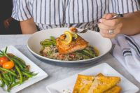

# MY FAVORITE FOOD
>Throughout my entire life, I have liked several kinds of food. I should mention that I am a fun of rice, chicken, githeri and chapati. Of course I can eat any other thing apart from kales and beans; courtesy of a medical condition that I recently developed. 
>
>My favorite food is sweet, easy to cook and readily available. It can be taken with a variety of other foods such as; 
* cabbages 
* chicken stew
* beef stew
* pork stew 
* green grams
* et cetera. 
>
>In Kenya, a kilogram of this food currently goes for approximately Kenya shillings 250. 
>
>My favorite food is **rice**.

[click here](https://www.go4worldbusiness.com/suppliers/kenya/rice.html) to connect with quality rice growers and suppliers in Kenya.